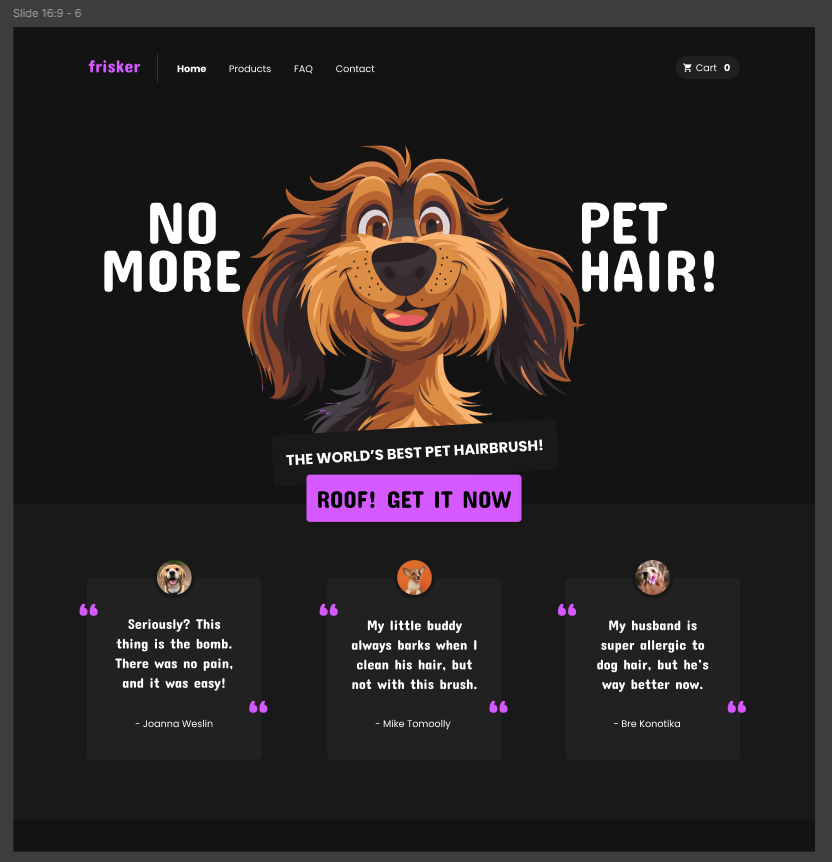

# React e Material UI

Este projeto é uma landing page construída com React e Material UI. A landing page possui um design moderno, e a implementação foi baseada em um protótipo visual no Figma.


**Protótipo Inteiro:**


**Implementação:**


Clique [aqui](https://www.figma.com/design/MnFjY4TyCKhFJ9FhtM0sg8/30-Days-UIUX-Challenge-(Community)?node-id=17-117&p=f&t=ctKNlpe7j9KfGpgF-0) para ser redirecionado ao Figma.

## Tecnologias Utilizadas

- **React**: Biblioteca JavaScript para construção de interfaces de usuário.
- **Material UI**: Framework de componentes para React com design material.
- **TypeScript**: Superset do JavaScript que adiciona tipagem estática ao código.

## Pré-requisitos

Antes de começar, é necessário ter as seguintes ferramentas instaladas:

- [Node.js](https://nodejs.org/en/) (versão 14 ou superior)
- [npm](https://www.npmjs.com/)

## Como Rodar o Projeto

1. **Clone o repositório:**

```bash
  git clone git@github.com:reidn3r/react-materialui.git
  cd react-materialui
```

2. **Instale as dependências:**

```bash
  npm install
  ```

3. **Inicie o servidor:**

```bash
  npm run dev
  ```

4. **Acesse no navegador:**

```bash
  http://localhost:5173
  ```
